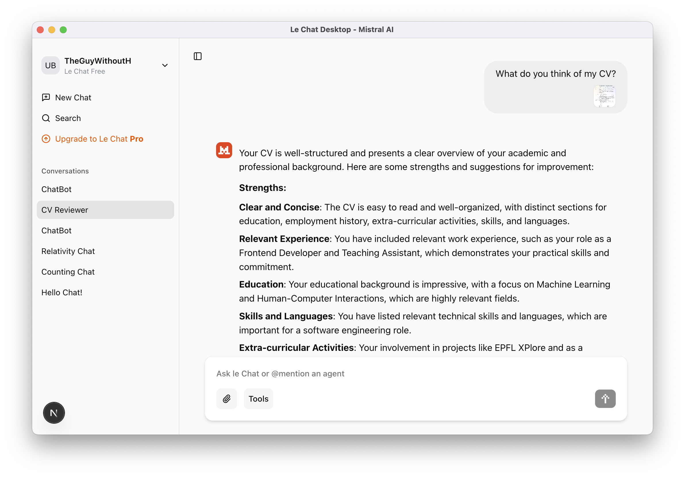
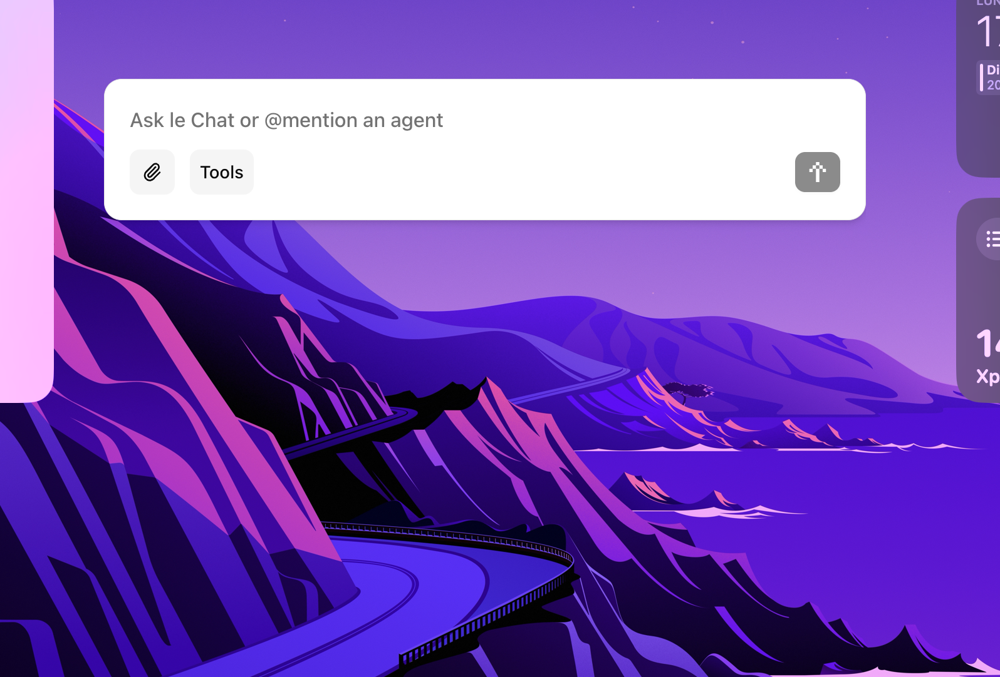

# Le Chat Desktop 🪄

Le Chat Desktop is a desktop application that allows users to quickly access Le Chat. With a single shortcut, users can open the application and begin chatting with the AI. They can also access the classical user interface to interact with the AI and see their prompt history.

It is compatible with Windows, MacOS, and Linux.

## Usage

You can create a new chat by clicking on the "New Chat" button. You can also search for a chat by clicking the "Search" button and typing in the search bar.

To clear all chats, click on the "Clear All" button in the profile dropdown (same place as the settings in the Mistral interface).

To copy the chat text, click on the "Copy" button. To quickly search for a chat, press `Ctrl + Shift + I`.

## Installation

To install the application, download the repository and run `npm install` in the root directory. Then, run `npm run build` and `npm run dev` to start the application.

## Development

This app is based on the [Next.js Electron example](https://medium.com/@aleksej.gudkov/how-to-build-an-electron-app-with-next-js-a-complete-guide-6f6ddf0111b2), and use Mistral's API for the chat.

Here are the current features supported:

- [x] Chat with the AI
- [x] Mistral interface
- [x] View chat history
- [x] Add PDFs and images to the chat
- [x] Search chats
- [x] Copy chat text
- [x] Quick search (Ctrl + Shift + I)
- [x] Clear all chats
- [x] Basic chat text formatting

The next features to be added are:

- [ ] Customizable shortcut and profile pictures
- [ ] Dark mode
- [ ] Navigation improvements
- [ ] Advanced chat text formatting
- [ ] Tools (websearch, canvas, etc.)
- [ ] Screenshot capabilities to share screen in chat
- [ ] Extensive testing

## License

This project is licensed under the Apache 2.0 License - see the [LICENSE](LICENSE) file for details.
